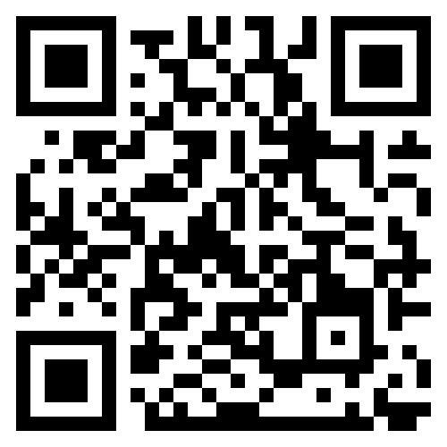

# Bullets 
 multimodal opening
 
- Point A
- Point B [see figure](#){.fragment .opens-modal
  data-modal-type="image"
  data-modal-url="https://picsum.photos/1400/900?random=42"}
- Point X [see figure](#){.fragment .opens-modal
  data-modal-type="iframe"
  data-modal-url="https://networkx.org/documentation/stable/index.html"}
- Point C
- Point D

<!-- #
{width=40% fig-align="center"}

:::{.r-stack}
To follow along, visit [www.maxnoichl.eu/talk](www.maxnoichl.eu/talk)
::: -->

:::{.nonincremental}
- **09:00 – 09:30**: Arrival and coffee.
- **09:30 – 10:00**: Introductions and general remarks.  
- **10:00 – 11:15**: Keynote by Adrian Wüthrich & Discussion
- *11:15 – 11:30: Short break*  
- **11:30 – 12:00**: Presentation on network visualization in [edhiphy](https://edhiphy.org/) by Gregor Bös.  
- *12:00 – 13:30: Lunch break*  
- **13:30 – 14:45**: Keynote by Catherine Herfeld & Discussion
- *14:45 – 15:00: Short break*  
- **15:00 – 15:30**: Presentation on [OpenAlex Mapper](https://huggingface.co/spaces/m7n/openalex_mapper) by Max Noichl.  
- **15:30 – 17:00**: Guided walkthrough of state-of-the-art text-analysis notebooks (different difficulties available).  
- **17:00 – 18:00**: Brainstorming session, initiating individual and/or group projects.  
:::

# Schedule – Day 2

:::{.nonincremental}
- **09:00 – 09:30**: Arrival and coffee.  
- **09:30 – 12:00**: Facilitated project work.  
- *12:00 – 13:00: Lunch break*  
- **13:00 – 14:00**: Continued project work.  
- **14:00 – 15:00**: Project snapshots and farewell.  
:::

# Project-links

* [edhiphy](https://edhiphy.org/) 
* [OpenAlex Mapper](https://huggingface.co/spaces/m7n/openalex_mapper)

# AI assisstance

To help you with understanding and writing computer code, we have set up an a way for you to chat with ChatGPT for free during the workshop. You can go to this website: [https://niek.github.io/chatgpt-web/](https://niek.github.io/chatgpt-web/), and enter the API-key that we send to you per email. We also reccomend to set the model you chat with to o3. 

# Colab notebooks

1. Text analysis (NER, Embeddings, Clustering): [https://colab.research.google.com/github/MNoichl/data-driven-philosophy-GAP2025/blob/main/workbook_01_text_analysis.ipynb](https://colab.research.google.com/github/MNoichl/data-driven-philosophy-GAP2025/blob/main/workbook_01_text_analysis.ipynb) 
2. Network analysis (community detection, visualization, pagerank): [https://colab.research.google.com/github/MNoichl/data-driven-philosophy-GAP2025/blob/main/workbook_02_network_analysis.ipynb](https://colab.research.google.com/github/MNoichl/data-driven-philosophy-GAP2025/blob/main/workbook_02_network_analysis.ipynb) 

